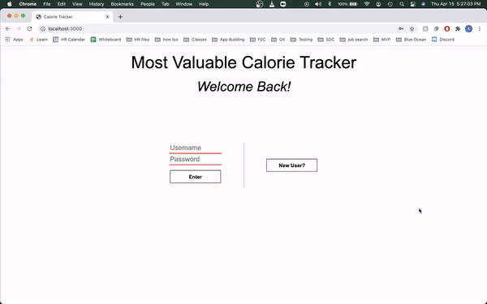

# Most Valuable Calorie Tracker
A calorie tracking app \
*by*\
[Agustin Feliciano](https://github.com/gusfel)
---
A calorie tracking app for multiple users with log ins.  Keeps track of your daily calorie intake from food vs calorie output from activites based on a daily calorie limit that the user sets.  Pulls food and exercise calorie data from the [Link](nutritionix.com) database.  Stores user data in a PostgreSQL database.

**Technologies Used**
1. React
2. NodeJS
3. ExpressJS
4. PostgreSQL
5. HTML
6. CSS

**Setup**
1. With PostgreSQL installed locally run `psql [username] .schema.sql`
2. Run `npm install`
3. Run `npm run build`
4. Run `npm start`
5. Open localhost:3000 in a browser

\* You wont be able to pull calorie data becauase you need to set up an API key, but you can still navigate around the app.  See below for a gif of the functionality:

